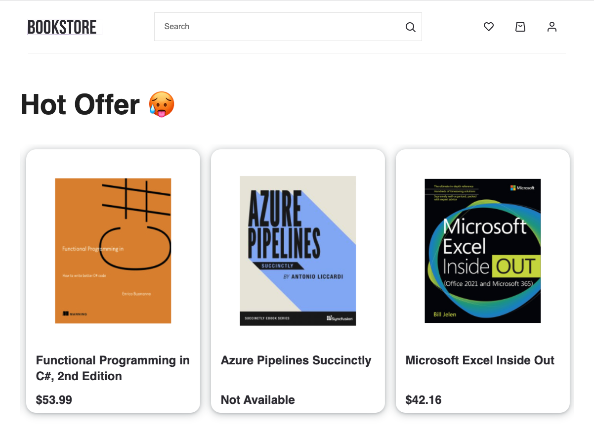
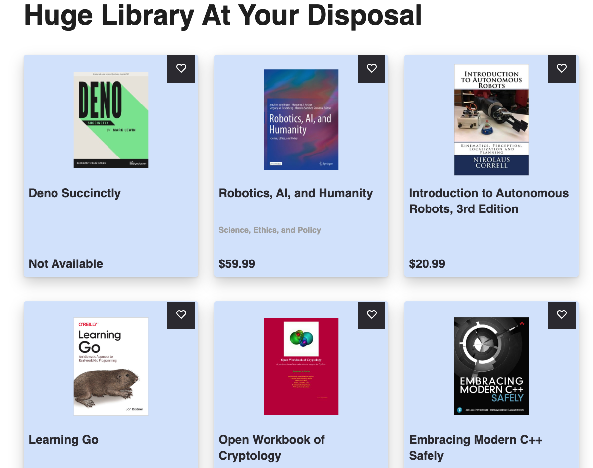
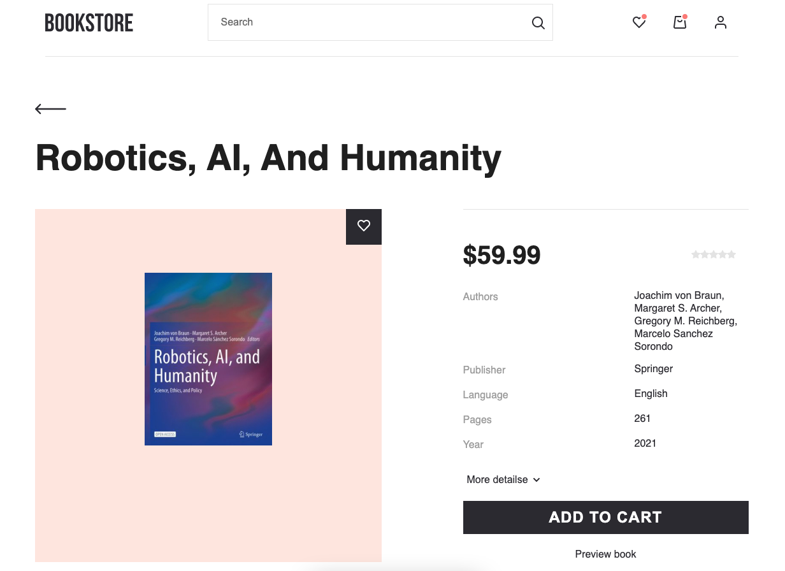
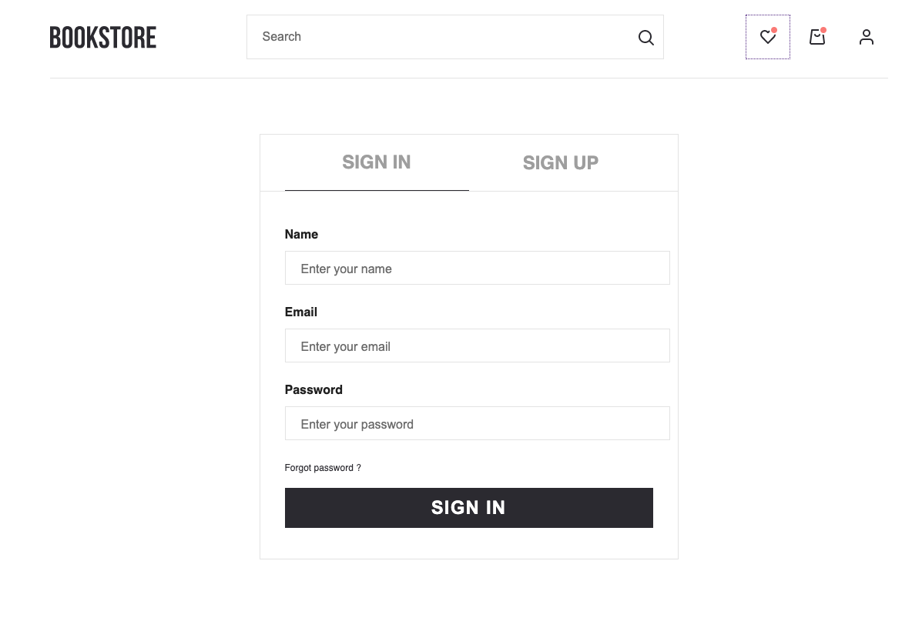

<div id="top"></div>
<!-- PROJECT -->
<br />
<div align="center">
    <p align="center">
    *
    <a href="https://igoralshuk.github.io/bookstore/">Watch Demo</a>
    * </p>
</div>
<p align="center">BookStore</p>




<p align="center">BookDetails</p>


<p align="center">Authentication</p>


User ability:

- Registration
- Authorization
- Add or remove book from favorites list
- Add books to cart and see total price
- Watch book details
- Watch book preview pdf
- Search books
- Pagination

### Installation

1. Get a free API at [IT Bookstore API](https://api.itbook.store/)
2. Register on [Firebase](https://firebase.google.com/), create your data base and copy Firebase configuration
3. Clone the repo
   ```sh
   git clone https://github.com/IgorAlshuk/bookstore.git
   ```
4. Install NPM packages
   ```sh
   npm install
   ```
 
### Tools and packages

- [React.js](https://reactjs.org/)
- [Redux Toolkit](https://redux-toolkit.js.org/)
- [React Router](https://reactrouter.com/)
- [React Router Dom](https://www.npmjs.com/package/react-router-dom)
- [React Hook Form](https://react-hook-form.com/)
- [React Slick](https://react-slick.neostack.com/)
- [uuid](https://www.npmjs.com/package/uuid)
- [Axios](https://axios-http.com/docs/intro)
- [Styled-components](https://styled-components.com/)
- [Typescript](https://www.typescriptlang.org/)
- [Firebase](https://firebase.google.com/)
- [gh-pages](https://pages.github.com/)

<p align="right">(<a href="#top">back to top</a>)</p>